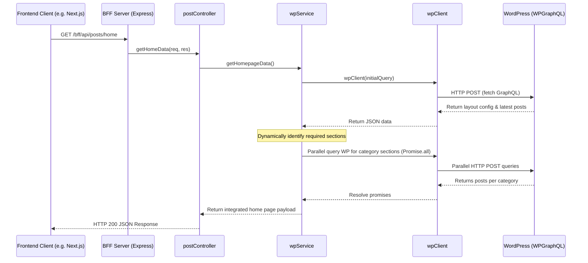

# BFF (Backend-for-Frontend) Documentation

This document provides a technical walkthrough and reference for the **BFF (Backend-for-Frontend)** application.

## Overview
The BFF layer acts as an aggregator and abstraction layer between the Headless CMS client (e.g., a Next.js frontend) and the WordPress CMS. It exposes cleaner REST endpoints, performs GraphQL queries to WordPress in parallel, handles service health checks, and parses content (including Rank Math SEO data) before returning it to the client.

---

## Codebase Map

Here is the breakdown of files in the BFF directory:

| Path | Description |
|---|---|
| [index.js](file:///C:/Users/subhradip.majumder/Desktop/subhro/headless_cms/apps/BFF/src/index.js) | Application entry point. Configures Express, CORS, mounts route controllers, performs initialization connectivity checks, and exposes the `/bff/health` endpoint. |
| [postRoutes.js](file:///C:/Users/subhradip.majumder/Desktop/subhro/headless_cms/apps/BFF/src/routes/postRoutes.js) | Defines the REST API endpoints and maps them to functions in the controller. |
| [postController.js](file:///C:/Users/subhradip.majumder/Desktop/subhro/headless_cms/apps/BFF/src/controller/postController.js) | Formulates REST HTTP responses and maps request data to service operations. Handles exceptions gracefully with structured error JSONs. |
| [wpService.js](file:///C:/Users/subhradip.majumder/Desktop/subhro/headless_cms/apps/BFF/src/services/wpService.js) | Formulates and sends complex WPGraphQL queries to WordPress. Contains optimizations like `Promise.all` parallel querying for homepage category sections. |
| [wpClient.js](file:///C:/Users/subhradip.majumder/Desktop/subhro/headless_cms/apps/BFF/src/utils/wpClient.js) | Low-level fetch wrapper built on top of `node-fetch`. Executes POST requests against the GraphQL API. |
| [package.json](file:///C:/Users/subhradip.majumder/Desktop/subhro/headless_cms/apps/BFF/package.json) | NPM configuration and dependencies (Express 5, Cors, Dotenv, Node-Fetch, Nodemon). |
| [Dockerfile](file:///C:/Users/subhradip.majumder/Desktop/subhro/headless_cms/apps/BFF/Dockerfile) | Multi-stage Dockerfile containing `deps`, `builder`, and `runner` stages to minimize production image footprint. |
| [docker-compose.yml](file:///C:/Users/subhradip.majumder/Desktop/subhro/headless_cms/apps/BFF/docker-compose.yml) | Docker Compose configurations allowing easy containerized local testing. |

---

## Architectural Flow

Below is the interaction sequence diagram showing how the BFF processes a client request:



---

## API Endpoints Reference

All application endpoints are prefixed with `/bff/api/posts` (except the health check).

### Core Features & Endpoints

#### 1. Server Health Check
* **Route**: `/bff/health`
* **Method**: `GET`
* **Workflow**:
  1. Requests a basic site title from WPGraphQL to check connectivity.
  2. If WP is up, returns `200` status with metadata:
     ```json
     {
       "status": "UP",
       "services": {
         "bff": "healthy",
         "wordpress": "connected"
       },
       "timestamp": "..."
     }
     ```
  3. If WordPress is down, returns `503 Service Unavailable` with connection details.

#### 2. Latest Articles
* **Route**: `/bff/api/posts/latest`
* **Method**: `GET`
* **Query Parameters**: `limit` (default: 5)
* **Returns**: Array of the latest `limit` posts including category and ancestor slugs.

#### 3. Homepage Aggregator
* **Route**: `/bff/api/posts/home`
* **Method**: `GET`
* **Workflow**:
  - Pulls latest 15 posts.
  - Queries `homepage-settings` page layout config (which lists the categories/slugs to show as sections on the homepage).
  - Parallel-queries (`Promise.all`) details and posts for all referenced categories.
  - Combines promotional settings (`firstImage`, `firstLink`, `secondImage`, etc.) and returns the fully assembled data structure.

#### 4. Post Details
* **Route**: `/bff/api/posts/detail/:slug`
* **Method**: `GET`
* **Workflow**: Fetches post details by `slug`, returning the parsed content, author metadata, categories, and Rank Math SEO fields (`title`, `focusKeywords`, `description`, `fullHead`).

#### 5. Category Details
* **Route**: `/bff/api/posts/category/:slug`
* **Method**: `GET`
* **Workflow**:
  1. Resolves category meta (name, description, post count, SEO) by category slug.
  2. Fetches the latest 20 articles matching that category's resolved name.

#### 6. Authors & Topics
* **Route**: `/bff/api/posts/author/:slug` & `/bff/api/posts/topic/:slug`
* **Method**: `GET`
* **Returns**: Profile metadata (such as avatar/bio for authors) or tag details, along with their respective recent posts and SEO tags.

#### 7. Navigational Menus
* **Routes**: `/bff/api/posts/topmenu/`, `/bff/api/posts/topmenu/primary`, `/bff/api/posts/topmenu/secondary`
* **Method**: `GET`
* **Returns**: Navigational link node trees registered under the corresponding menu location IDs in WordPress (`TOP_NAV`, `PRIMARY_NAV`, or `SECONDARY_NAV`).

---

## Configuration & Run Scripts

### Node Scripts
- Run local development server with live reload:
  ```bash
  npm run dev
  ```
- Start production application:
  ```bash
  npm start
  ```

### Multi-Stage Dockerfile
```dockerfile
# Stage 1: Build dependency graph (prod only)
FROM node:20-alpine AS deps
WORKDIR /app
COPY package*.json ./
RUN npm ci --omit=dev

# Stage 2: Bundle application source code
FROM node:20-alpine AS builder
WORKDIR /app
COPY package*.json ./
RUN npm ci
COPY . .

# Stage 3: Package light runtime runner
FROM node:20-alpine AS runner
WORKDIR /app
ENV NODE_ENV=production
COPY --from=deps /app/node_modules ./node_modules
COPY --from=builder /app/src ./src
COPY --from=builder /app/package*.json ./
EXPOSE 9595
CMD ["node", "src/index.js"]
```

### Docker Compose Configuration
The service is pre-configured to run under Docker Compose. It adds a host gateway mapping `host.docker.internal` pointing to the host machine, making it easier for the container to talk to a local database/WordPress stack outside the Docker network.

To run:
```bash
docker-compose up --build -d
```
